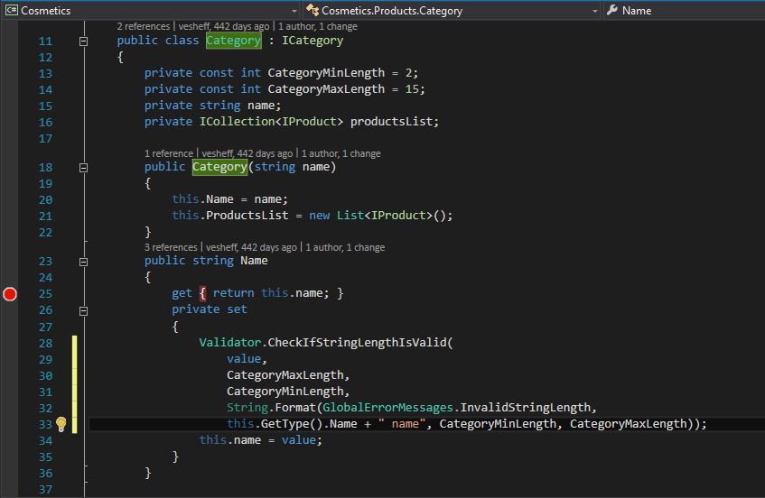
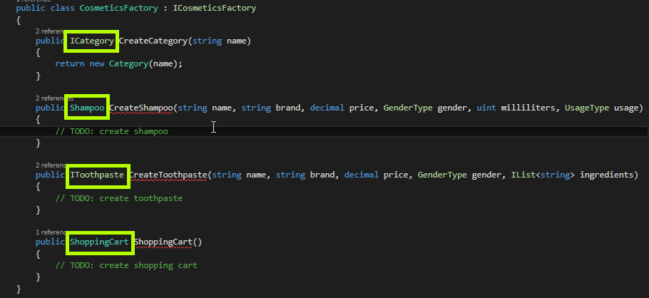
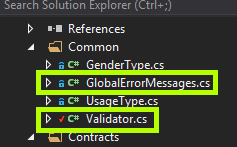
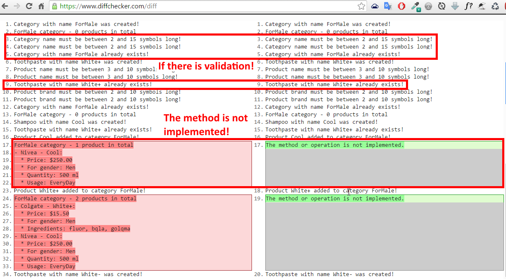
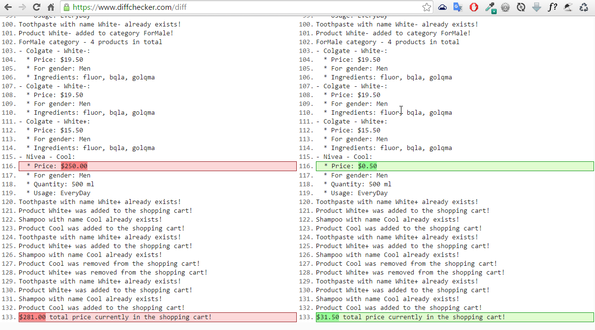

## Cosmetics shop

### Description
In the shop there are currently two types of **products: shampoos** and **toothpastes**. Each product has **name, brand, price and gender** (men, women, unisex). Each **shampoo** has **quantity** (in milliliters) and **usage** (every day or medical). All shampoos’ price is per milliliter. Toothpastes have **ingredients**. There are **categories** of products. Each **category** has **name** and products can be **added or removed**. The same product can be added to a category more than once. There is also a **shopping cart**. Products can be **added or removed** from it. The same product can be added to the shopping cart more than once. The shopping cart can calculate the **total price** of all products in it.

### Task
Your **task** is to **design an object-oriented class hierarchy** to model the cosmetics shop, **using the best practices for object-oriented design** (OOD) and **object-oriented programming** (OOP). **Avoid** duplicated code though abstraction, inheritance, and polymorphism and encapsulate correctly all fields.

You are given few C# interfaces that you should **obligatory** implement and use as a basis of your code:

#### 1. Categories should implement ICategory.
- Adding the same product to one category more than once is allowed.
- Minimum category name’s length length is 2 symbols and maximum is 15 symbols.
- The error message should be **"Category name must be between {min} and {max} symbols long!""**.
- Products in category should be sorted by brand in ascending order and then by price in descending order.
- When removing product from category, if the product is not found, the error message should be **"Product {product name} does not exist in category {category name}!""**.
- Category’s print method should return text in the following format:


```
 {category name} category – {number of products} products/product in total
- {product brand} – {product name}:
  * Price: ${product price}
  * For gender: Men/Women/Unisex
  * Ingredients: {product ingredients, separated by “, “} (when applicable)
- {product brand} – {product name}:
  * Price: ${product price}
  * For gender: {product gender}
  * Quantity: {product quantity} ml (when applicable)
  * Usage: EveryDay/Medical (when applicable)
```

#### 2.  All products should implement the IProduct interface.
- Minimum product name’s length is 3 symbols and maximum is 10 symbols.
- The error message should be **"Product name must be between {min} and {max} symbols long!"**.
- Minimum brand name’s length is 2 symbols and maximum is 10 symbols.
- The error message should be **"Product brand must be between {min} and {max} symbols long!"**.
- Gender type can be **"Men"**, **"Women"** or **"Unisex"**.

#### 3. All shampoos should implement the IShampoo interface.

#### 4. All toothpastes should implement the **IToothpaste** interface.
- Ingredients should be represented as text, joined in their order of addition, separated by ", "  (comma and space).
- Each ingredient name’s length should be between 4 and 12 symbols, inclusive. The error message should be **"Each ingredient must be between {min} and {max} symbols long!"**.

#### 5. Shopping cart.
- Adding the same product more than once is allowed.
- Do not check if the product exists, when removing it from the shopping cart.


### Constraints
- Look into the example below to get better understanding of the printing format.
- All number type fields should be printed “as is”, without any formatting or rounding.
- All properties in the above interfaces are mandatory (cannot be null or empty).
- If a null value is passed to some mandatory property, your program should throw a proper exception.

### Additional notes
- To simplify your work you are given an already built execution engine that executes a sequence of commands read from the console using the classes and interfaces in your project (see the Cosmetics-Skeleton folder).
- Please, put your classes in namespace Cosmetics.Products.
- Implement the CosmeticsFactory class in the namespace Cosmetics.Engine.
- You are **only allowed** to write classes and **extract appropriate interfaces**. You are **not allowed** to **modify the existing interfaces and classes** except the **CosmeticsFactory** class.

## Step by step guide

#### **Hint**: You don't need to take care at the Engine class and the Main method but of course you could try to understand how they work.

#### **Hint**: Use the least possible access modifiers for all the members.

**1.** You are given a skeleton of the Cosmetics shop. Please take a look at it carefully before you try to do anything. Try to understand all the classes and interfaces and how the engine works. (You should not touch the engine at all).

**2.** Just build the project and look at the errors.


**3.** The errors are in CosmeticFactory class. The four methods there are not implemented.
- Think what they return and what you should do.
    - **Hint** (create class Category which implements an interface. Think which is the interface.)

    ```cs
    public ICategory CreateCategory(string name)
    {
        return new Category(name);
    }
    ```

**4.** The category class should have a constructor with name as parameter.

- **Hint**:



- Implement the rest of the Category class by yourself.

**5.** Let's get back to the CosmeticFactory class



- Do you see something strange here?
- Lets change the return types from classes to interfaces!
- Don't forget to change the return type in ICosmeticsFactory with interfaces as well.

**6.** ShoppingCart class
- Extract interface IShoppingCart from ShoppingCart class.
- Initialize the products list in the constructor and implement the methods.
- **Hint**: return new collection instead of the original one.

    

**7.** Now you have the ShoppingCart class ready.
 - Look at the **Hint** at point 3 and return the ShoppingCart

**8.** Now you should have only two build errors.


**9.** Lets take a look at the Shampoo class.
- Do you see that the Shampoo implements IProduct and IShampoo, therefore the Shampoo is a product. Do we have another product to create?
- Do you think you could abstract the product. If yes, how?
- **Hint**: You could create class Product which implements IProduct interface. Think about the class modifier.
Which are the different properties of the Toothpaste and the Shampoo.
- **Hint**: Look at the CosmeticsFactory class and look at the signature of the methods for creating Shampoo and Toothpaste.
- Do not forget to validate all the properties you need.

    

- Remember that the price of the two products is formed differently. Think about virtual properties.

**10.** After you abstract the Product class and extract common properties from Shampoo and Toothpaste it is time to create the Toothpaste class. Just take a look at the Shampoo class and it is almost the same. Do not forget about the validations all the time.

**11.** Now you have the two classes ready and lets go back to the CosmeticsFactory class and finish the methods.
 - In the CreateToothpaste method you receive IList<string> and in the constructor you receive just a string. Think about conversion from List to string and be careful about the separator. You should validate every ingredient. Think about how to do it.

**12.** Now the build should be successful if everything is fine.

**13.** Lets try to put the zero test in use :)
 - Copy the output and put it in [https://www.diffchecker.com](https://www.diffchecker.com)
 

 - If there is no validation of the property and the output is not the same on lines 3a nd 4 and you are not aware how to do it take a look at the **Hint** in point 4.
 - The validation for line 5 is done in the Engine.

**14.** If we carefully look at the input we will see that the method which is not implemented is the Print method in the Category.

- **Hint**:

    
- Just finish the method. You should implement the Print method of the products as well. Please note that the print mehtod of the Product could be reused in the concrete product (Shampoo or Toothpaste). Virtual methods maybe?

- The concrete Print mehtod could call the base Print mehtod.

    

**15.** Another diff checker and the result is:
    

- What is the problem here?
- What about the price of the two products again?

**16.** As you saw we don't need to look at the Engine class and the Main method  at all.

**17.** We have used Interfaces in all the places and now we could easily add another product or even a new Command in the Engine class without making multiple if else or switch statements.

**17.** We have used Interfaces in all the places and now we could easily add another product or even a new Command in the Engine class without making multiple if else or switch statements.
